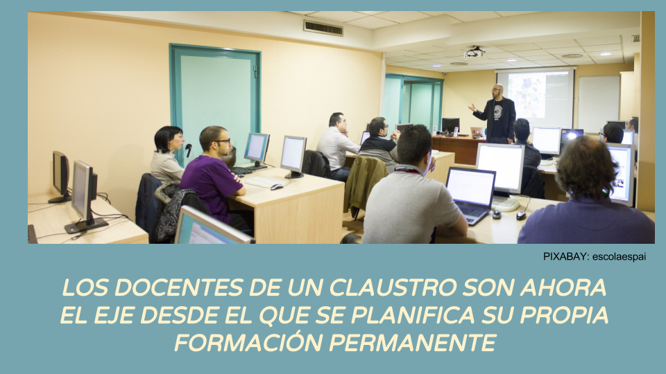

# INTRODUCCIÓN {#introducci-n}

                       Imagen extraída de infografía del CIFE Sabiñánigo

La calidad de la enseñanza en las aulas depende en gran medida de la formación de sus docentes. Un claustro bien formado puede afrontar con muchas más garantías de éxito los retos que su tarea diaria plantea.

Explicamos brévemente la transformación en la formación del profesorado en Aragón en los últimos años, como ejemplo cercano de cambio de paradigma en la formación del profesorado, con el Claustro como eje de su propio aprendizaje.    

Hasta el curso 2007-2008 el número de actividades de formación que se realizaban en los centros educativos, fuera de los Centros de Profesores y Recursos en Aragón era bajo, en comparación con los cursos, seminarios y grupos de trabajo que estos Centros ofrecían al profesorado. Los Proyectos de Formación en centro eran muy escasos, el liderazgo de la formación del profesorado era sin ninguna duda de los Centros de Profesores, y de la Administración Educativa correspondiente, y las actividades se orientaban hacia los individuos en lugar de hacia los colectivos.

A partir del curso 2007-2008, al observarse y evidenciarse la poca transferibilidad que ese modelo de formación del profesorado presentaba en las aulas, y en una búsqueda de estrategias más eficaces, surgieron iniciativas provinciales experimentales, como la planteada en el Plan Provincial de Formación del Profesorado en Competencias Básicas de la Provincia de Zaragoza 2008-2010, que supuso un cambio de paradigma en la formación del profesorado en la provincia, fortaleciendo la modalidad de Proyectos de Formación “en y de” centros e incorporando otras novedades formativas como la orientación hacia la formación en colectividad.

A partir de las conclusiones extraídas tras estas iniciativas, la formación colectiva dentro de los mismos centros educativos y en base a sus necesidades específicas fue priorizándose en las convocatorias de los planes de los CPRs, y desde el 2009-10 en la ya convocatoria unificada en todo Aragón.

Finalmente, la aprobación del [Decreto 105/2013, de 11 de junio, del Gobierno de Aragón](https://www.google.com/url?q=http://www.educaragon.org/Files/Files/UserFiles/File/DECRETO%2520Form%2520Prof_BOA%252025-6-2013.pdf&sa=D&ust=1516098480746000&usg=AFQjCNGIf_4cqfm_sV-Pyh0C_l8U-azBZg), por el que se regula el sistema aragonés de formación permanente del profesorado, su régimen jurídico y la estructura de su red, la consiguiente creación de los CIFEs y UFIs, y la aparición del COFO como líder indiscutible de la formación del profesorado dentro de los centros educativos, completó la implantación del nuevo modelo de formación del profesorado.

La formación del profesorado dentro del centro educativo ha tenido desde entonces, entre otros, estos objetivos prioritarios básicos:

*   Fortalecer las competencias de ese Claustro en concreto en base a sus necesidades reales y específicas.
*   Reforzar la autonomía del centro para generar sus propias prácticas innovadoras y  conseguir mejoras educativas.
*   Promover la colaboración y el trabajo en equipo dentro de los Claustros.
*   La puesta en práctica de los resultados del aprendizaje de manera directa en el aula en un corto periodo de tiempo.

Se recomienda la lectura del artículo Balance de un modelo de formación del profesorado: veintisiete años de los Centros de Profesores y Recursos de Aragón (1985-2012), de Fernando González Olloquiegui y Alfonso Cortés Alegre publicado en el número 6 de la revista Forum Aragón, de Octubre 2012, de donde se ha extraído la información histórica para esta introducción, así como del resto de artículos de ese mismo número dedicados a la Formación del Profesorado.

[http://www.ebropolis.es/files/File/Varios/Revista_Forum_Aragon_6.pdf](https://www.google.com/url?q=http://www.ebropolis.es/files/File/Varios/Revista_Forum_Aragon_6.pdf&sa=D&ust=1516098480747000&usg=AFQjCNGoRXkZQGUkX1JImzd1_3rAhFpbPw) 

Al igual que ha sucedido en las últimas décadas con el proceso de enseñanza-aprendizaje del alumnado de los centros educativos, la formación del profesorado ha cambiado también su eje vertebrador, siendo ahora los Claustros los protagonistas de esa formación, en lugar de los Centros de Profesores y Departamentos de Educación.

Pero, ¿qué supone para un centro educativo y para un Claustro este nuevo enfoque?

Vamos poco a poco desgranando sus efectos.