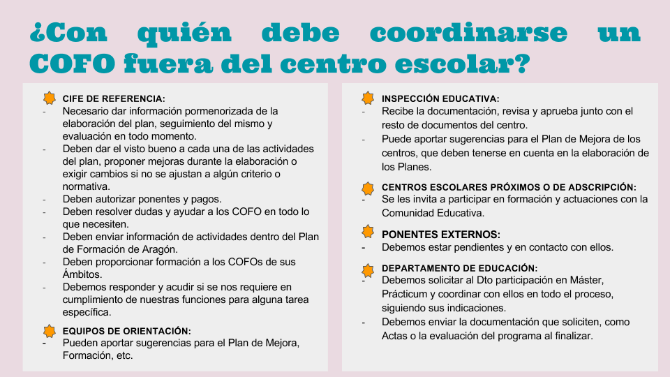
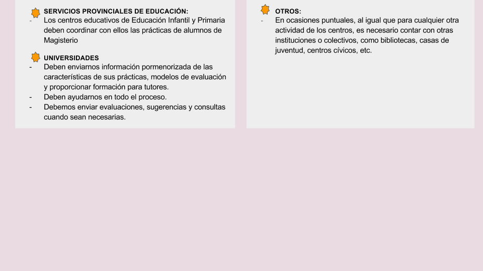
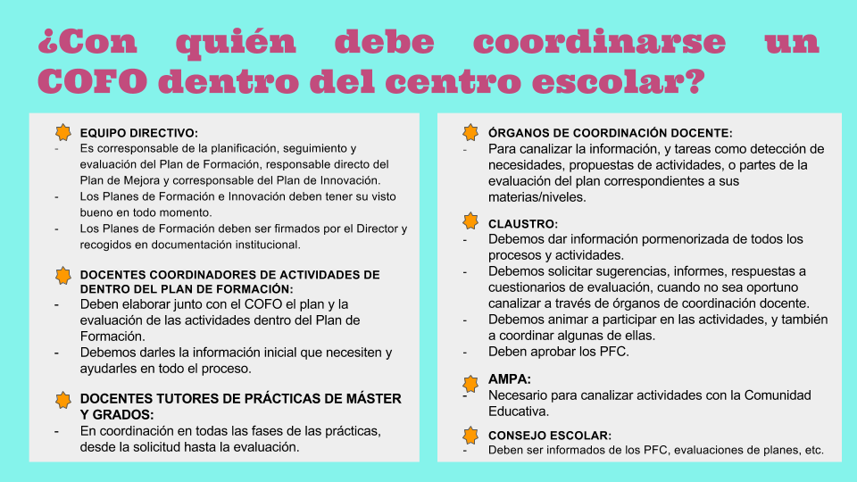

# UNIDAD 3- COORDINACIÓN CON LA RED DEL PROFESORADO Y CON OTROS SUJETOS E INSTITUCIONES QUE INTERVIENEN EN EL CENTRO EDUCATIVO {#unidad-3-coordinaci-n-con-la-red-del-profesorado-y-con-otros-sujetos-e-instituciones-que-intervienen-en-el-centro-educativo}

Los COFO deben coordinarse con varias instituciones y agentes externos en cumplimiento de sus funciones como tal, en especial, las directamente asociadas con los Planes de Formación de los centros y con su función de coordinador de las prácticas académicas externas de los alumnos universitarios.

En el cuadro anterior se encuentran las más importantes.

Por otro lado, no debemos olvidar la labor de coordinación que debe existir entre el COFO y grupos de docentes y órganos dentro del propio centro, que incluimos en el cuadro siguiente: 

