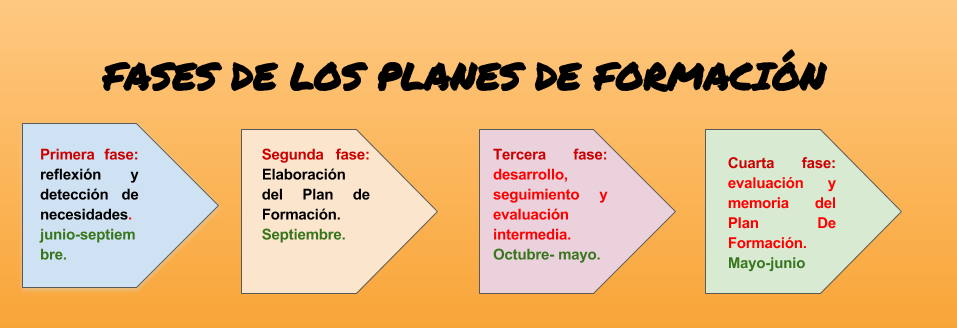
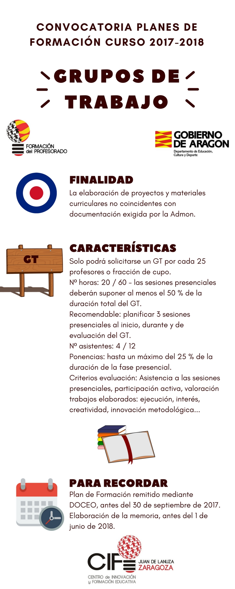
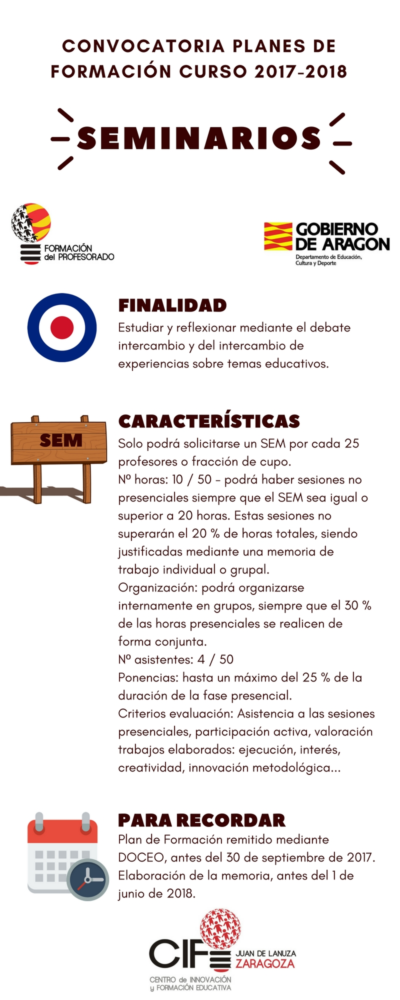
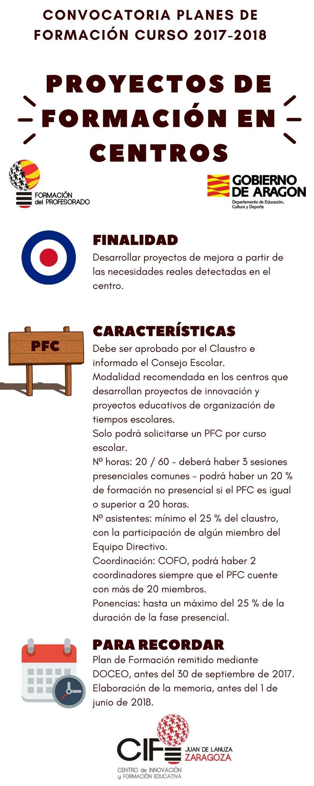

# UNIDAD 4- PLANES DE FORMACIÓN EN CENTROS {#unidad-4-planes-de-formaci-n-en-centros}

Todos los centros educativos de la Comunidad Autónoma de Aragón, públicos y privados concertados, de niveles no universitarios, dependientes del Departamento de Educación, Cultura y Deporte, deben elaborar su propio Plan de Formación que estará configurado fundamentalmente por las diferentes actuaciones de formación que realice el profesorado del centro. Éstos planes de formación deberán seguir las pautas que el Departamento de Educación instruya en la convocatoria al efecto, que en los dos últimos cursos ha sido publicada en junio del curso anterior, y recogerán además de las iniciativas formativas de los centros educativos para sus Claustros, cualquier otra actividad de formación individual que los docentes quieran comunicar a modo informativo.

Incluimos enlaces a las últimas convocatoria publicadas:

[http://www.educaragon.org/FILES/CONVOCATORIA%20PFC%202016-17.pdf](https://www.google.com/url?q=http://www.educaragon.org/FILES/CONVOCATORIA%2520PFC%25202016-17.pdf&sa=D&ust=1516098480766000&usg=AFQjCNFs2j7jkKwgZes9u7KIK1fIqdIu3w) 

[http://www.educaragon.org/FILES/Planes%20de%20formaci%C3%B3n%20de%20centros.pdf](https://www.google.com/url?q=http://www.educaragon.org/FILES/Planes%2520de%2520formaci%25C3%25B3n%2520de%2520centros.pdf&sa=D&ust=1516098480767000&usg=AFQjCNHY1ipVePXjgu61mg8jFks5BvWHkg) 

Como consta en varias normativas, las actividades de formación propuestas y desarrolladas dentro del plan, tendrán lugar, preferentemente, fuera del horario de atención directa a los alumnos excepto aquellas que tengan carácter institucional, convocadas por las administraciones educativas u otras que excepcionalmente puedan ser autorizadas por causas debidamente justificadas.

El Plan de Formación de Centro no es un mero documento recopilatorio e informativo, sino que constituye una herramienta en sí misma para planificar, diseñar y evaluar las actividades de formación que un Claustro decida poner en marcha, y que irán orientadas a :

*   Promover la mejora de la institución escolar como organización educativa.
*   Impulsar el trabajo colaborativo entre iguales.
*   Fomentar el desarrollo de proyectos de centro con carácter interdisciplinar.
*   Invitar a la reflexión.
*   Convertir el centro en el elemento básico de propuestas de mejora, formación e innovación de implementación inmediata.

Primera fase: reflexión y detección de necesidades. Entre junio-septiembre.

Es importante recordar que debemos basarnos en dos aspectos esenciales asociados:

*   Los objetivos de mejora de los centros educativos.
*   La situación competencial del Claustro para conseguir esos objetivos.

Además debemos contemplar la adecuación de nuestras propuestas al Plan Marco de Formación del Profesorado de Aragón.

Entre junio y septiembre, comienza en los centros la fase de reflexión, de decisión sobre objetivos de mejora y de detección de las necesidades formativas del Claustro con respecto a ellos.

| Instrumentos para esta primera fase: |
| --- |
| Consejos prácticos para esta primera fase: |

Segunda fase: Elaboración del Plan de Formación. Septiembre.

El Plan de Formación del Centro es elaborado por el Coordinador de Formación del centro y otros docentes del Claustro coordinadores de actividades en colaboración con el Equipo Directivo y el Departamento de Formación e Innovación Educativa en los Institutos de Educación Secundaria, o el Departamento de Innovación y Transferencia del Conocimiento en los CPIFP. Una vez informado el Claustro, se incluye en la Programación General Anual.

La elaboración del plan es siempre fruto de la coordinación telemática a través de la plataforma [DOCEO](https://www.google.com/url?q=https://cifes.aragon.es/modulos/index.php&sa=D&ust=1516098480773000&usg=AFQjCNEs2oo_OcP-ngxlDJaEKmpgwW82yA) entre centros educativos y los Centros de Innovación y Formación Educativa, que colaboran en el diseño, desarrollo y seguimiento.

Dentro de los centros, los Coordinadores de Formación y los Coordinadores de cada una de las actividades que se van a proponer (el COFO no tiene porqué coordinar todas ellas) formalizan su propuesta en DOCEO, cumplimentando toda la información general del Plan y de cada una de las actividades que lo van a conformar.

El asesor de formación del CIFE de referencia del centro educativo orienta al Coordinador de Formación y al Equipo Directivo en cuanto a la viabilidad del proyecto y a la adecuación de las acciones formativas planteadas para los objetivos que se pretenden alcanzar y contribuye a dotar de coherencia al plan elaborado.

Posteriormente el equipo pedagógico del CIFE determina qué actividades serán gestionadas y certificadas desde el mismo en función de su adecuación a las características establecidas  y su utilidad para la consecución de los objetivos planteados así como de los recursos disponibles.

Una vez se acabe de ajustar el Plan por parte de todos, el Centro lo envía telemáticamente dentro de la plataforma.

Además de este trámite telemático, otros imprescindibles son:

*   Documento de aprobación de los Claustros de su Proyecto de Formación en Centro.
*   El Consejo Escolar debe ser informado del Proyecto de Formación en Centro.

| Instrumentos para la segunda fase: |
| --- |
| Consejos prácticos: |

       

Tercera fase: desarrollo, seguimiento y evaluación intermedia. De octubre a mayo.

Los servicios técnicos de apoyo (Inspección de Educación y Equipos de Orientación Educativa y Psicopedagógica) supervisarán los planes y podrán orientar a los equipos directivos en la identificación de ámbitos de mejora y establecimiento de objetivos.

De octubre a mayo tienen lugar las actuaciones de formación, bajo el seguimiento del COFO y Equipo Directivo.

Sigue siendo necesaria la colaboración continua entre el COFOs y otros Coordinadores de actividades y su CIFE de referencia.

Tras la evaluación intermedia en enero, es posible incorporar alguna modificación en el Plan de Formación si se considera necesaria.

| Consejos prácticos: |
| --- |

Cuarta fase: evaluación y memoria del Plan De Formación. Mayo-junio

A lo largo del mes de mayo se procede a efectuar la evaluación de cada actividad del Plan, y la evaluación del Plan en sí.

La evaluación consistirá en aplicar los criterios de evaluación utilizando los instrumentos planificados para ello (cuestionarios, observación, material generado, etc), y obtener unas conclusiones finales sobre el cumplimiento de los objetivos iniciales, y unas propuestas para el futuro.

Desde el punto de vista administrativo, ésta tiene lugar de nuevo telemáticamente a través de la plataforma Doceo, y será fruto de la colaboración entre el COFO y otros docentes coordinadores de actividades.

La Memoria debe recoger todas las actividades de formación y actualización en las que haya participado algún docente del centro, tanto las planificadas dentro de sus Planes de Formación como aquellas realizadas que hayan sido promovidas por la Administración Educativa u otras distintas que los docentes hayan realizado por iniciativa individual a lo largo del curso.

Los materiales generados por actividades en el marco de los Planes de Formación de los centros, deberán estar a disposición del CIFE de referencia para su supervisión, en formato digital y por vía telemática. Se recomienda a los centros el desarrollo de un dossier de formación o portafolio recogiendo informes e históricos sobre los resultados de la aplicación de los indicadores de evaluación.

| Consejos prácticos: |
| --- |

Resumen de las tareas del COFO asociadas directamente al Plan de Formación del Centro. Cuadro adaptado del ofrecido por el CIFE Juan de Lanuza en su información de comienzo de curso:

| TAREAS | TAREAS CENTRO | APOYO |
| --- | --- | --- |
| Diseño del Plan, detección de necesidades: junio-septiembre | 

*   Reflexión sobre las características del centro, y análisis de documentación.
*   Definir los objetivos deseables para el plan de formación.
*   Cumplimentar los formularios de apoyo para la detección de necesidades.

 | 

*   Inspección: revisión de la PGA.
*   Asesoría de referencia: informes finales de actividades, revisión memora Plan.
*   Documentos específicos de detección de necesidades desde el Departamento de Educación y CIFES.

 |
| Elaboración: septiembre | 

*   Actualización de los datos del centro y del profesorado.
*   Recogida de demandas formativas (propuestas de actividades, coordinadores).
*   Plan y creación de actividades
*   Inclusión en la PGA, una vez informado el claustro.

 | 

*   Asesoría de referencia: contacto directo.
*   Formación teórica a los COFO (itinerario formativo).
*   Asesoría asignada informa de cada actividad, elección de ponentes, apoyo personal, presupuesto.
*   CIFE: notificación de las actividades certificables.

 |
| Desarrollo: octubre-mayo | 

*   Seguimiento de las actividades (actas y asistencia).
*   Resolución de problemas (ausencias coordinador…)
*   Evaluación intermedia (enero-febrero)

 | 

*   Asesoramiento y apoyo a los coordinadores de actividades del Plan en el seguimiento de las mismas.
*   Asesoría de referencia: Gestión de ponentes y gastos.

 |
| Evaluación | 

*   Memoria actividades  y propuesta de certificación.
*   COFO y E.D.: Memoria del Plan de Formación.

 | 

*   CIFE: Informe final y propuesta certificación.

 |